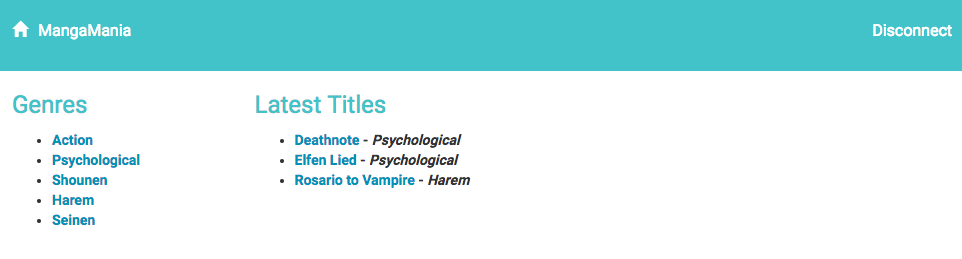
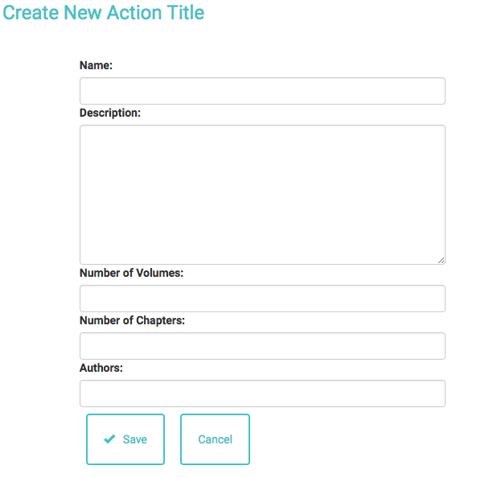

# MangaMania

A manga site to allow users to post and edit manga titles with their information
based on categories.

## Getting Started

This project can be forked or cloned to get all required files for local
deployment and testing.  A seed file is provided to populate the database with
initial entries.

### Prerequisites

**Flask** - handles all frontend logic, routing, and rendering of template files. Install via pip

```
pip install Flask
```

**SQLAlchemy** - ORM to support interaction between frontend and database.
Install via pip

```
pip install SQLAlchemy
```

**SQLite** - database. [Additional information for installation can be found on the SQLite website](https://www.sqlite.org/download.html)

**virtualenv** - optional virtualization for easy workflow during development, allows for multiple installations of python. Install via pip

```
sudo pip install virtualenv
```

### Installing

* Creating the database
Set up the database by running `python database_setup_manga.py`

* Seeding the database
A seed file is provide to populate the initial database and get the app up and running. Data can be loaded by running `python seed_db_manga.py `

* Start the web server
Run `python project.py`

* Accessing the web app
By default, the app is set to run on port 5000.  The app will be able to be accessed by navigating to http://localhost:5000/ in the browser




## Built With

* [Flask](http://flask.pocoo.org/) - Python web framework
* [SQLAlchemy](https://maven.apache.org/) - Python SQL Toolkit and Object Relational Mapper
* [SQLite](https://rometools.github.io/rome/) - SQL database engine
* [Virtualenv](https://rometools.github.io/rome/) - Tool for creating isolated Python environments
